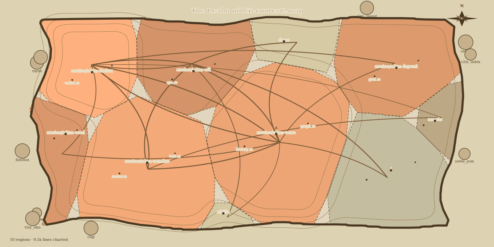

# context2map (`c2m`)

**Your repository as a map your AI can actually read.**

`c2m` compiles a whole codebase into a *Repository Atlas* — a query-conditioned
semantic map image plus a small text legend — that a vision LLM can survey in
**~2,000 tokens**, then zoom back to exact source through stable handles.
Written in Rust; a 5,000-file repo maps **cold in ~0.4 s**.



*(this image is `c2m badge` run on this repo — regenerate it any time)*

## The idea

Dumping a repo into an LLM context costs hundreds of thousands of tokens.
Text "repo maps" cover a sliver of the tree. `c2m` takes a third path, backed
by recent research on optical context compression (DeepSeek-OCR, Glyph,
LensVLM): render **structure, not text, into pixels**, and keep everything
exactness-critical — code, identifiers, instructions — in text.

- **Position** = module topology (semantically-close code is spatially close)
- **Cell area** = code size · **city dots** = important files (PageRank)
- **Elevation ▲1–▲5** = relevance *to your current task* (lexical + embedding
  + graph diffusion + git churn)
- **Roads** = imports/references · **red hatch** = trust hazards (network,
  exec, secrets, eval)
- **Offshore islands** = external dependencies

Every element carries a stable handle (`R3`, `F103`, `S12`). The map is a
**lossy, reversible index**: the model looks at the atlas, picks a region,
and calls back for exact source. Selective expansion of a compressed view is
exactly the loop LensVLM (arXiv:2605.07019) showed reaches full-text parity
at ~4× effective compression — zero-shot on commercial models.

## Quickstart

```bash
cargo install --path crates/c2m-cli   # or: cargo build --release

c2m map "fix the session expiry bug"  # atlas.png + legend + handles
c2m zoom R3                           # region tile: files + symbols
c2m read F103 --lines 40:120          # exact source, always text
c2m locate "session"                  # find handles

c2m render --out map.svg              # the pretty human map (parchment theme)
c2m badge                             # README-sized hero image
```

On small repos `c2m map` automatically emits a text-only roster when that is
cheaper than an image — it never spends your tokens on a picture that doesn't
pay for itself.

### Use it from a coding agent

Copy the bundled skill and your agent gets the whole workflow:

```bash
cp -r skills/c2m ~/.claude/skills/    # Claude Code
```

The atlas legend is self-describing (schema + affordances restated every
render), so any VLM-capable agent can use the CLI directly too.

## Provider-aware token budgeting

`c2m map --provider claude --budget 2000` solves for the largest raster whose
*provider-computed* cost fits the budget, snapped to the provider's patch grid
so no tokens are wasted on padding:

| Provider | Accounting | 1024×1024 costs |
|---|---|---|
| `claude` | ⌈w/28⌉×⌈h/28⌉ patches | 1369 |
| `openai` (gpt-4o/4.1/5) | 70 + 140/tile | 630 |
| `openai-mini` | 32-px patches ×1.62 | 1659 |
| `gemini` (Gemini 3) | fixed steps 280–2240 | 1120 |
| `qwen` (Qwen3-VL) | 32-px blocks | 1026 |

## Measured, not vibes

`c2m calibrate` renders a synthetic repo with planted ground truth (a known
summit, a known hazard, a known dependency) and emits objective probe
questions; with `ANTHROPIC_API_KEY` and `--live` it scores a real model's
map-reading ability. `c2m bench` compares atlas vs text-only localization
accuracy at matched token budgets on your own task set. Legibility is a
tested property here, not an assumption.

## Performance

Layout geography is **stable**: cell positions persist in `.c2m/` and only
move when the code structure moves, so spatial memory (yours and the
model's prompt cache) survives across queries.

| Repo | Cold map | Warm map |
|---|---|---|
| this repo (55 files) | 70 ms | 60 ms |
| synthetic, 5,000 files | 0.42 s | 0.42 s |

Everything is deterministic: same tree + same query ⇒ byte-identical PNG.

## How it works

```
ingest (gitignore-aware) → tree-sitter symbols/imports (6 languages)
→ dependency graph + PageRank → hashed TF-IDF embeddings
→ query relevance (BM25 + cosine + personalized-PageRank diffusion + churn)
→ grid power-diagram treemap (persisted, stable geography)
→ themed render (VLM theme / parchment theme) → PNG/SVG + legend + sidecar
```

Full design rationale, research grounding, and roadmap: [docs/DESIGN.md](docs/DESIGN.md).

## License

Apache-2.0. Embedded DejaVu fonts under their own license
(`assets/fonts/LICENSE-DejaVu`).
